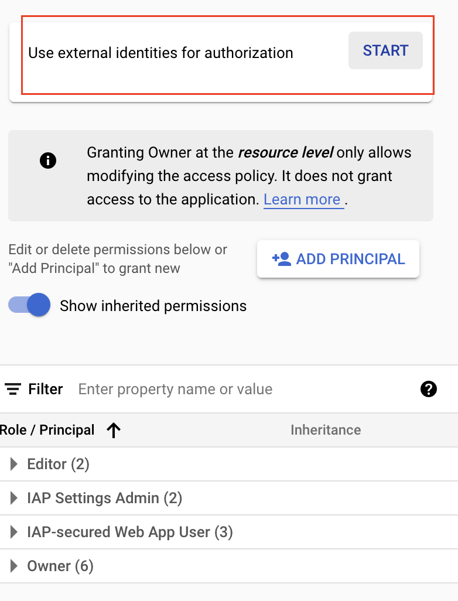

# Boutique on Cloud Run

The project is to demostrate how to migrate Kubernetes application into Cloud Run in order to leverage the power of serverless computing. The demo application was forked from https://github.com/GoogleCloudPlatform/microservices-demo with necessary changes.


## Thoughts about switch to Cloud Run

- Simplify the management of infrastruture, focus on applications instead of underneath infrastructure. 

- Automated scalability & scale to zero.

- Enhanced observerbility by default, such as metrics, trace, audit logs, etc.

- Built-in security, support https by default, Binary authentication, IAM, integration with IAP, etc.

- Support serverless on-premises.


## What to change

1. Take out enssential content from YAML to create serving service.
2. Configure parameters for each individual services.
3. Configure service to service call with proper authentication. 
4. Expose the public service through GLB.


## Deploy into Managed Cloud Run

```bash

# 1. Prerequisite
gcloud services enable 
gcloud iam service-accounts

# 2. Setup Botique on Cloud Run
git clone git@github.com:cc4i/boutique-on-cloudrun.git
cd boutique-on-cloudrun

gcloud builds submit --config=cloudbuild.yaml --async

```

## Deploy into Cloud Run on GKE

```bash

export PROJECT_ID=play-with-anthos-340801
export CLUSTER=cloudrun-gke
export REGION=asia-east2
export ZONE=asia-east2-b

# Provision GKE
gcloud container --project ${PROJECT_ID} clusters create ${CLUSTER} \
    --machine-type "n2d-standard-4" \
    --scopes "https://www.googleapis.com/auth/cloud-platform" \
    --num-nodes "3" \
    --workload-pool "${PROJECT_ID}.svc.id.goog" \
    --zone ${ZONE}


# Run following commands in CloudShell
mkdir bin;cd bin
curl https://storage.googleapis.com/csm-artifacts/asm/asmcli_1.13 > asmcli
chmod +x asmcli
./asmcli install \
  --project_id ${PROJECT_ID} \
  --cluster_name ${CLUSTER} \
  --cluster_location ${ZONE} \
  --fleet_id ${PROJECT_ID} \
  --output_dir ~/bin \
  --enable_all \
  --ca mesh_ca
# 

# Apply Cloud Run to GKE
gcloud container fleet cloudrun apply --gke-cluster=${ZONE}/${CLUSTER}

```


## Integrate with IAP

1. Create OAuth branding. They're set to internal and must be manually set to public if desired, go to [OAuth consent screen]

```bash
# Create oauth brand 
gcloud alpha iap oauth-brands create \
  --application_title="Botique on Cloud Run" \
  --support_email=<service account@email>

# Check out brand
gcloud alpha iap oauth-brands list

```

2. Create an IAP OAuth Client, take notes of CLIENT_ID & CLIENT_SECRET from response.

```bash

export BRAND-ID="Boutique on Cloud Run"

gcloud alpha iap oauth-clients create \
  projects/${PROJECT_ID}/brands/${BRAND-ID} \
  --display_name=NAME
```
The response contains the following fields:
```
name: projects/[PROJECT_NUMBER]/brands/[BRAND_NAME]/identityAwareProxyClients/[CLIENT_ID]
secret: [CLIENT_SECRET]
displayName: [NAME]

```


2. Setting up a glolab external HTTPs load balancer with a Cloud Run Service.

```bash

export SERVERLESS_NEG_NAME=frontend-neg
export CLOUD_RUN_SERVICE_NAME=frontend
export BACKEND_SERVICE_NAME=frontend-backend-service
export URL_MAP_NAME=frontend-url-map
export DOMAIN=[Domain Name]
export SSL_CERTIFICATE_NAME=frontend-cert
export TARGET_HTTPS_PROXY_NAME=frontend-https-proxy
export HTTPS_FORWARDING_RULE_NAME=frontend-forwarding-rule

gcloud run services update ${CLOUD_RUN_SERVICE_NAME} \
  --ingress=internal-and-cloud-load-balancing \
  --region=${REGION}

gcloud compute network-endpoint-groups create ${SERVERLESS_NEG_NAME} \
  --region=${REGION} \
  --network-endpoint-type=serverless  \
  --cloud-run-service=${CLOUD_RUN_SERVICE_NAME}
   
gcloud compute backend-services create ${BACKEND_SERVICE_NAME} \
  --load-balancing-scheme=EXTERNAL \
  --global
   
gcloud compute backend-services add-backend ${BACKEND_SERVICE_NAME} \
  --global \
  --network-endpoint-group=${SERVERLESS_NEG_NAME} \
  --network-endpoint-group-region=us-central1

gcloud compute url-maps create ${URL_MAP_NAME} \
  --default-service BACKEND_SERVICE_NAME

gcloud compute ssl-certificates create ${SSL_CERTIFICATE_NAME} \
       --domains ${DOMAIN}

gcloud compute target-https-proxies create ${TARGET_HTTPS_PROXY_NAME} \
  --ssl-certificates=${SSL_CERTIFICATE_NAME} \
  --url-map=${URL_MAP_NAME}
   
gcloud compute forwarding-rules create ${HTTPS_FORWARDING_RULE_NAME} \
  --load-balancing-scheme=EXTERNAL \
  --network-tier=PREMIUM \
  --address=example-ip \
  --target-https-proxy=${TARGET_HTTPS_PROXY_NAME} \
  --global \
  --ports=443
```
    
3. Connect domain name to load blanacer by add A record into your doamin management. For instance:

```
NAME                  TYPE     DATA
run                   A        30.90.80.100
```

4. Enable IAP globally with following commands. 

```bash

export CLIENT_ID=[CLIENT_ID]
export CLIENT_SECRET=[CLIENT_SECRET]

gcloud compute backend-services update \
  ${BACKEND_SERVICE_NAME} \
  --global \
  --iap=enabled,oauth2-client-id=${CLIENT_ID},oauth2-client-secret=${CLIENT_SECRET}
   
gcloud compute ssl-certificates create ${SSL_CERTIFICATE_NAME} \
    --domains ${DOMAIN}
```

### Notes for IAP: 
- This configuration allows all clients that are considered internal (per definition in Restricting ingress for Cloud Run) to access the Cloud Run service without authenticating. All other clients coming in through the external load balancer authenticate through IAP. This is a known limitation that will be addressed in the future.

- In [Indetity-Aware Proxy](https://console.cloud.google.com/security/iap) page to choose external identities for authorization and using [generated sign-in page](https://cloud.google.com/iap/docs/cloud-run-sign-in?_ga=2.69658834.-352041230.1644724472) or providing your [own](https://cloud.google.com/iap/docs/using-firebaseui?_ga=2.70232146.-352041230.1644724472). You must choose one of [identity providers](https://console.cloud.google.com/customer-identity/providers) with proper configuration.

>For example, choose service in "HTTP RESOURCES" tab under [Indetity-Aware Proxy](https://console.cloud.google.com/security/iap) page, then click "START":
>>


## Expand to multi-region deployment
```
TODO
```

## Notes for Cloud Run

>1. Be careful some of features are not support in managed Cloud Run, but have support in Knative. Reason for that is to reduce cold start.

>>Not supported:
>>    - readinessProbe
>>    - livenessProbe


>2. cpu < 1 is not supported with concurrency > 1

>3. Not support to inject evironments, such as "PORT" (due to conflict with system auto-injection)

>4. Services access other services on Cloud Run must be authorized, which has to provide identity token.

>5. Refactor how gRPC call other services with authorization - https://cloud.google.com/run/docs/triggering/grpc

>6. To get the dns of Cloud Run service, must deploy first. In some cases your services depends on other services, you must deploy dependent services and then retrieve the dns of the service, and then update related parameters before deployment. 

>7. Be careful with identity toke, by default the token will be expired after 60 minutes, so we should find a proper mechanism to manage those indentity token, processing them in application should be straight forward. Or alternatively store them into redis and process accordingly. 


